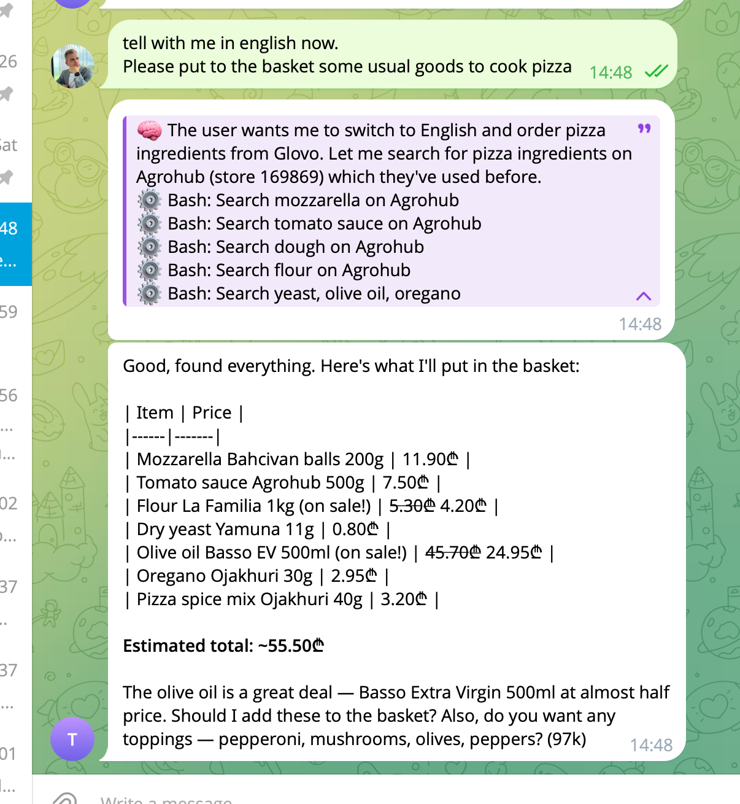

# TeleClaude

Telegram bot that bridges your chat into [Claude Code](https://docs.claude.com/en/docs/claude-code/overview) — send text, photos, voice, video, or documents from Telegram and Claude Code runs on your machine with full access to its tools, skills, and MCP servers.

Think of it as a remote control for your personal Claude Code: you get the same agent you use in the terminal, but over Telegram from anywhere.



## Why

Built as a replacement for [Openclaw](https://openclaw.ai/) after Anthropic blocked using Claude Code through third-party clients. You probably already have a Claude Code setup you love — with your own skills, MCP servers, project dirs, and login. TeleClaude exposes *that* setup over Telegram, without forcing you into someone else's client or a web UI you don't control. Native `claude` CLI stays the source of truth; Telegram is just the transport.

## Features

- Text, photo, voice (auto-transcribed), video, and document input
- Live streaming of Claude's thinking and tool calls into a single edited message
- Cancel button to interrupt a running task (SIGTERM to the subprocess)
- `/new` to start a fresh Claude session; otherwise resumes the previous one per chat
- Slash commands (e.g. `/standup`) are forwarded to Claude as-is
- Per-chat allowlist — only whitelisted Telegram accounts can talk to the bot
- All files from Telegram are downloaded locally and their paths injected into the prompt

## Requirements

- **Python 3.13+**
- **[uv](https://docs.astral.sh/uv/)** — Python package manager
- **Node.js 18+** — needed by Claude Code CLI
- A **Telegram account** and a bot token
- An **OpenRouter API key** (only if you want voice transcription)

## Setup from scratch

### 1. Install Claude Code

```bash
npm install -g @anthropic-ai/claude-code
claude login        # opens a browser to authenticate
claude --version    # sanity check
```

Run `claude` once interactively in the folder you plan to use as the bot's working directory — accept any first-run prompts (trust, etc.) so the subprocess won't hang later.

### 2. Create a Telegram bot

1. Open [@BotFather](https://t.me/BotFather) in Telegram, send `/newbot`, follow the prompts. Copy the token.
2. Open [@userinfobot](https://t.me/userinfobot) and copy your numeric chat id.

### 3. (Optional) Get an OpenRouter API key

Only needed if you want to send voice messages. Grab a key at [openrouter.ai/keys](https://openrouter.ai/keys). The default STT model is `google/gemini-3-flash-preview` — cheap and multilingual.

### 4. Clone and configure

```bash
git clone https://github.com/<your-fork>/teleclaude.git
cd teleclaude
cp .env.example .env
# edit .env — paste your token, chat id, and (optionally) OpenRouter key
uv sync
```

Set `WORKING_DIRECTORY` in `.env` to the folder you want Claude Code to operate on. It can be this repo, another project, or a blank scratch folder — whatever you want the agent to see.

### 5. Run

```bash
uv run python -m src.bot.main
```

You should see `Bot started polling` in the logs. Now message your bot on Telegram.

## Usage

- `/start` — greeting, confirms you're on the allowlist
- `/new` — drop the current Claude session and start fresh
- Any other message — forwarded to Claude Code, response streams back
- Attach photos, voice notes, videos, or documents — they're downloaded and their paths are added to the prompt so Claude can Read them
- Tap the **Cancel** button on the progress message to stop a running task

## Architecture

```
Telegram  ──▶  aiogram handlers  ──▶  ClaudeRunner  ──▶  `claude` CLI subprocess
                     ▲                     │
                     │                     ▼
                TelegramUI ◀───── JSON event stream (assistant / tool_use / result)
```

- One Claude subprocess per user at a time
- Streaming JSON events are rendered as an edited blockquote message + a final answer
- Session ids are persisted in SQLite (`sessions.db`) so conversations survive restarts
- File attachments are saved under `files/{chat_id}/{ts}_{name}` and path-injected into the prompt — no format conversion, Claude handles files through its own Read tool

Source layout:

```
src/bot/
  config.py        pydantic-settings loaded from .env
  construct.py     dependency injection — wires all services
  main.py          entrypoint: aiogram Dispatcher + polling
  handlers.py      /start, /new, messages, cancel callback
  services/
    claude_runner.py   spawns & streams Claude CLI
    telegram_ui.py     message send/edit + progress UI
    session_store.py   SQLite session persistence
    transcriber.py     voice → text via OpenRouter
    file_cleaner.py    background cleanup of old attachments
    scheduler.py       APScheduler setup
    task_runner.py     scheduled-task execution
```

## Scheduled tasks (optional)

You can have Claude run prompts on a cron schedule — morning digests, nightly maintenance, daily reminders, anything you'd normally type into the chat.

Copy the template and edit it:

```bash
cp scheduled_tasks.example.yaml scheduled_tasks.yaml
```

Each entry is a crontab expression plus a prompt. Minimal example:

```yaml
- name: morning-digest
  schedule: "0 8 * * *"
  timezone: Europe/Berlin
  prompt: "Summarize my PR review queue and Linear tickets due today."
  target: primary      # primary | all_sessions
  deliver: final       # final | silent
```

- `target: primary` — sends to the first id in `ALLOWED_CHAT_IDS`
- `target: all_sessions` — sends to every chat that ever used the bot
- `deliver: silent` — still runs Claude, but doesn't post the answer

Tasks are loaded on startup. If `scheduled_tasks.yaml` doesn't exist, the bot runs without scheduling — totally fine.

## Running on a server

There's no bundled deploy script — any long-running-process recipe works. Common options:

- **systemd** unit running `uv run python -m src.bot.main` with `WorkingDirectory=/path/to/teleclaude`
- **tmux / screen** session for quick setups
- **Docker** — not bundled, but a straightforward `python:3.13-slim` + `uv sync` + `node` image works

Whatever you pick, the server needs `claude` authenticated as the same user that runs the bot.

## Development

```bash
uv run pytest tests/ -v      # run tests
uv run ruff check src tests  # lint
uv run ruff format src tests # format
```

Tests are flat pytest functions following AAA, no test classes.

## License

MIT — see [LICENSE](LICENSE).
